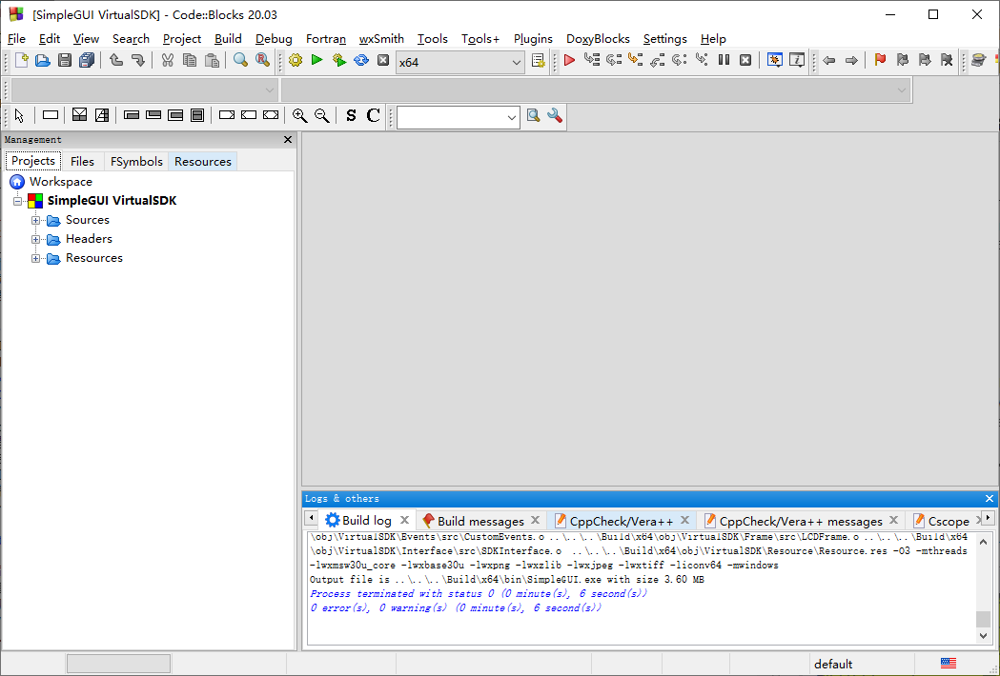
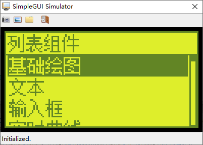
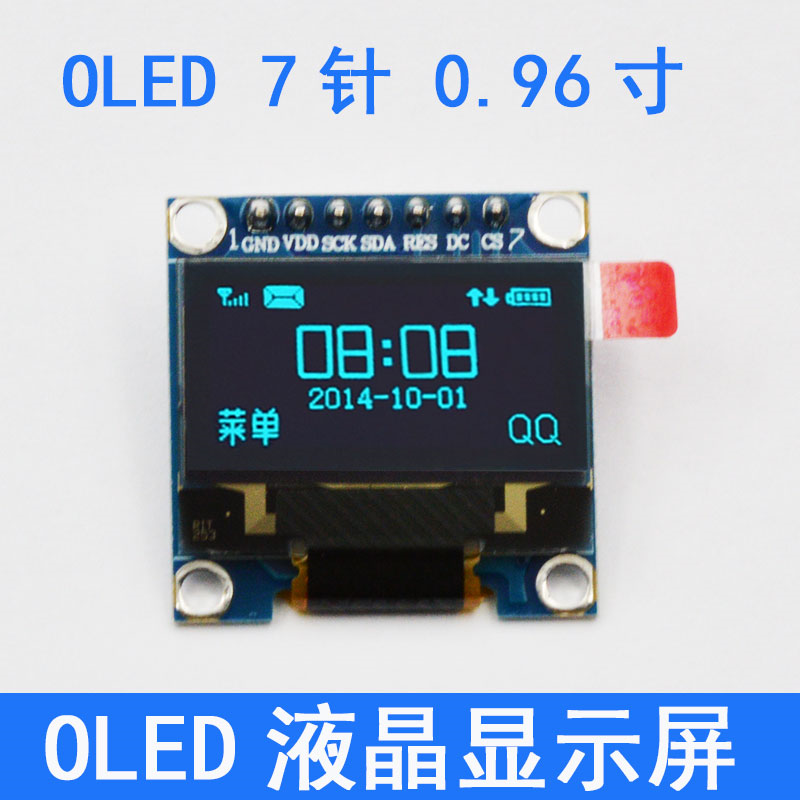
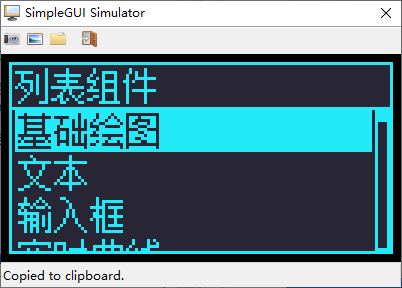
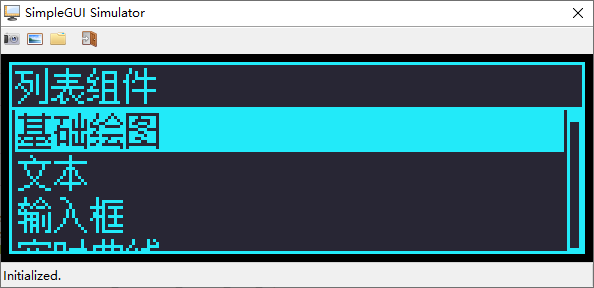
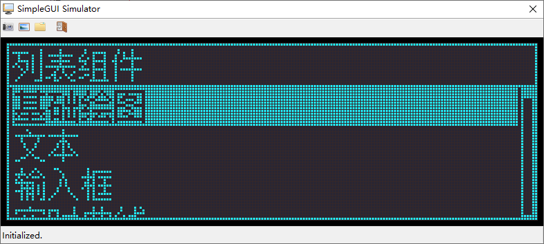
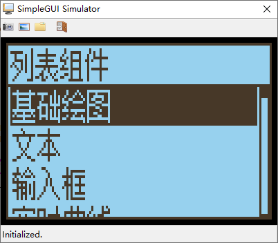

# 快速开始SimpleGUI  
---  
## 1. 了解SimpleGUI  
#### 1.1. SimpleGUI概述  
&emsp;&emsp;SimpleGUI是一个针对于单色显示屏设计和开发的GUI接口，提供了基本的点、线、矩形、圆等基本图形的绘制功能、文字和位图的绘制以及列表、滚动条、进度条等常用组件的绘制与控制功能。  
&emsp;&emsp;SimpleGUI的出发点，是在一个单色显示器上，以尽可能少的消耗、尽可能多且直观的表达需要的内容，为此，SimpleGUI抛弃了诸如图层、遮罩、阴影、非等宽字体等高级的、复杂的操作，力求以简单快捷、易于操作的方式，使开发者尽快实现自己需要的功能需求。 同时在满足基本绘图需求的前提下，SimpleGUI还提供了一套被称为HMI的交互引擎，用于统合用户交互、数据处理和屏幕内容绘制与更新，提供了一种简明、易组织、易拓展、低消耗的交互系统。  
  
#### 1.2. 获取SimpleGUI  
&emsp;&emsp;SimpleGUI目前托管在码云（Gitee）开源平台上，您可以通过Git工具，从码云上将SimpleGUI的全部代码和资料同步到本地，如果您不想使用Git工具，也可以在[SimpleGUI工程页面](https://gitee.com/Polarix/simplegui)中点击“克隆/下载”按钮，在弹出的窗口中点击“下载ZIP”按钮下载整个工程的压缩包文件。  
&emsp;&emsp;同步或下载解压SimpleGUI后，就可以使用SimpleGUI的Virtual SDK了，SimpleGUI的主目录结构和说明如下：  
  
|目录名|功能|  
|:- |:- |  
|DemoProc|SimpGUI的演示代码|  
|DemoProject|SimpleGUI的演示工程|  
|Documents|关于SimpleGUI的一些简要说明文档|  
|GUI|SimpleGUI的代码实现部分|  
|HMI|SimpleGUI的HMI模型实现部分|  
|VirtualSDK|Virtual SDK的工程及源码|  
  
## 2. 编译和使用VirtualSDK  
#### 2.1. 什么是VirtualSDK  
&emsp;&emsp;VirtualSDK是SimpleGUI的一个重要组成部分，用于在使用SimpleGUI开发时，脱离硬件平台进行图形界面开发的辅助工具。配合SimpleGUI的低耦合性接移植口定义，使用VirtualSDK开发的用户界面处理源码，几乎额可以无缝的移植到预期的硬件平台上。  
&emsp;&emsp;在初次接触SimpleGUI时，您可能尚未选定或准备好相应的硬件平台。鉴于这种情况，您可以从VirtualSDK开始，初步了解SimpleGUI的显示效果以及代码架构。  
  
#### 2.2. 编译VirtualSDK工程  
&emsp;&emsp;SimpleGUI的VirtualSDK工程，基于wxWidgets开发，使用CodeBlocks组织，所以在开始使用SimpleGUI的VirtualSDK前，您需要准备一下基于Codeblocks的wxWidgets开发环境。构建的方法请参照附加文档“[A1-搭建基于Codeblocks的wxWidgets开发环境](https://gitee.com/Polarix/simplegui/blob/Develope/Documents/A1-%E6%90%AD%E5%BB%BA%E5%9F%BA%E4%BA%8ECodeblocks%E7%9A%84wxWidgets%E5%BC%80%E5%8F%91%E7%8E%AF%E5%A2%83.md)”。  
&emsp;&emsp;进入VirtualSDK\Project\CodeBlocks目录，此目录中为SimpleGUI的VirtualSDK的工程文件，使用Code::Blocks打开，VirtualSDK_wx30.cbp对应使用wxWidgets的3.0.x版本库，VirtualSDK_wx31.cbp对应使用3.1.x版本库，请根据之前配置的wxWidgets版本选用。如果用户下载的是nosetup（绿色版）的Code::Blocks，需要手动建立关联才能直接用双击的方式打开cbp文件，否则，用户只能先打开Code::Blocks，然后从Code::Blocks中执行打开操作以打开工程文件。  
&emsp;&emsp;点击工具栏上的编译按钮或按快捷键Ctrl+F9，开始编译模拟环境演示工程。  
><p align='center'></img></p>   
  
&emsp;&emsp;编译完成，显示无错误和警告，现在点击工具栏上的运行按钮或按快捷键Ctrl+F10就可以看到模拟环境的运行效果了。  
><p align='center'></img></p>  
  
#### 3.3. 模拟不同型号和外观的屏幕效果  
&emsp;&emsp;默认情况下，VirtualSDK中虚拟显示屏幕的配色方案为黄底黑字的LCD点阵显示屏，为最大程度上模拟真实情况下的视觉效果，方便创建和调试GUI元素，VirtualSDK的LCD面板可以通过修改配置定义修改颜色和尺寸。  
&emsp;&emsp;打开VirtualSDK工程，进入VirtualSDK\Common\src文件夹（对应工程路径/SimpleGUI/Headers/VirtualSDK/Common/src），打开Common.cpp文件，找到以下代码：  
```c++  
    void SetLCDPanelParameter(PixelPanelParameter* pstParameter)  
    {  
        if(NULL != pstParameter)  
        {  
            // Appearance  
		    pstParameter->HorizontalPixelNumber = PARAM_DEFAULT_PIXEL_NUM_H;  
		    pstParameter->VerticalPixelNumber = PARAM_DEFAULT_PIXEL_NUM_V;  
		    pstParameter->PixelUnitWidth = PARAM_DEFAULT_PIXEL_WIDTH;  
		    pstParameter->PixelUnitHeight = PARAM_DEFAULT_PIXEL_WIDTH;  
		    pstParameter->EnableGrid = PARAM_DEFAULT_GRID_ENABLE;  
		    pstParameter->BorderWidth = PARAM_DEFAULT_PANEL_BORDER_WIDTH;  
		    // ScreenColor  
		    pstParameter->PanelColor = LCD_COLOR_OBJ_BKG;  
		    pstParameter->PixelColor = LCD_COLOR_OBJ_PIX;  
		    pstParameter->GridColor = LCD_COLOR_OBJ_GRID;  
        }  
    }  
```  
&emsp;&emsp;这里是设定的VirtualSDK的模拟LCD面板的相关参数，定义如下：  
  
|成员/变量名|功能|  
|:- |:- |  
|pstParameter->HorizontalPixelNumber|横向像素点数量|  
|pstParameter->VerticalPixelNumbe|纵向像素点数量|  
|pstParameter->PixelUnitWidth|屏幕像素单元宽度|  
|pstParameter->PixelUnitHeight|屏幕像素单元高度|  
|pstParameter->EnableGrid|是否启用像素网格|  
|pstParameter->BorderWidth|边缘宽度|  
|pstParameter->PanelColor|逻辑有效像素点颜色（前景颜色）|  
|pstParameter->PixelColor|逻辑无效像素点颜色（背景颜色）|  
|pstParameter->GridColor|网格颜色|  
  
&emsp;&emsp;VirtualSDK默认状态下模拟的是黄底黑字的LCD显示屏，不显示像素网格。如果要模拟其他屏幕的显示效果，可以使用一张要模拟屏幕的照片，使用取色工具获取屏幕背景、像素以及边框颜色的RGB值，比如淘宝上的照片，就可以直接使用。  
><p align='center'></img></p>  
&emsp;&emsp;然后将颜色的RGBA值分别更新入三个宏定义中，颜色使用32位无符号整数表示，从高至低四字节的意义分别为A、B、G、R。例如上图中屏幕背景色、像素色和网格色分别设定为0xFF342628、0xFFF9EA22和0xFF2A2835，通常情况下，网格颜色与背景色相同，或与背景色相近。  
```c++  
    pstParameter->PanelColor = 0xFFF9EA22;  
    pstParameter->PixelColor = 0xFF342628;  
    pstParameter->GridColor = 0xFF2A2835;  
```  
&emsp;&emsp;重新编译后，即可看到效果，此时已经模拟为黑底蓝字的OLED显示屏。  
><p align='center'></img></p>  
  
&emsp;&emsp;此外，还可以修改模拟的屏幕尺寸，例如我们想要模拟19264的屏幕，分别修改HorizontalPixelNumber和VerticalPixelNumbe的值为192和64。  
```c++  
		    pstParameter->HorizontalPixelNumber = 192;  
		    pstParameter->VerticalPixelNumber = 64;  
```  
&emsp;&emsp;然后修改演示程序代码DemoProc/src/DemoProc.c文件中InitializeHMIEngineObj函数中对屏幕设备尺寸的设定，如果这里的尺寸不跟随模拟LCD的尺寸变化而修改，运行时的显示区域将可能不正确，显示效果出现异常。  
```c++  
           /* Initialize display size. */  
           g_stDeviceInterface.stSize.iWidth = 192;  
           g_stDeviceInterface.stSize.iHeight = 64;  
```  
&emsp;&emsp;然后重新编译工程并运行。  
><p align='center'></img></p>  
  
&emsp;&emsp;如果想要使能像素网格，可以将：  
```c++  
            pstParameter->EnableGrid = PARAM_DEFAULT_GRID_DISABLE;  
```  
&emsp;&emsp;修改为：  
```c++  
            pstParameter->EnableGrid = PARAM_DEFAULT_GRID_ENABLE;  
```  
&emsp;&emsp;同时修改屏幕像素尺寸为4或4以上  
```c++  
            pstParameter->PixelUnitWidth = 4;  
		    pstParameter->PixelUnitHeight = 4;  
```  
&emsp;&emsp;重新编译后，效果如下：  
><p align='center'></img></p>   
  
  
>- 需要注意的是，由于网格线显示时占用1像素，为了避免画面显示失调，SimpleGUI的Virtual  SDK仅在LCD像素点尺寸（也就是宏定义PARAM_DEFAULT_PIXEL_SIZE）的值大于4时，网格设定才会有效，在像素点尺寸小于4时，网格线将被强制关闭。  
  
&emsp;&emsp;像素单元的长宽可以分别指定，如果想要模拟的屏幕像素单元并非正方形，那么可以按照近似的比例设置像素单元的尺寸，以对外观进行最大程度上的模拟，例如常见的诺基亚5110的屏幕。  
><p align='center'></img></p>   
  
  
&emsp;&emsp;根据上述讲解，采集图片中屏幕和像素的颜色，更新Common.c中的颜色参数设定，这里不准备启用网格，所以网格色不做修改。  
```c++  
            pstParameter->PanelColor = 0xFFEED197;  
            pstParameter->PixelColor = 0xFF283847;  
```  
&emsp;&emsp;将像素尺寸修改为4×3。  
```c++  
            pstParameter->PixelUnitWidth = 3;  
		    pstParameter->PixelUnitHeight = 4;  
```  
&emsp;&emsp;关闭网格显示。  
```c++  
            pstParameter->EnableGrid = PARAM_DEFAULT_GRID_DISABLE;  
```  
&emsp;&emsp;重新编译后，效果如下：  
><p align='center'></img></p>   
  
  
&emsp;&emsp;至此，您已经可以通过VirtualSDK，模拟SimpleGUI在您预期的设备上的显示效果，此外您还可以通过键盘，和Demo程序进行交互，查看更多组件的显示和动作效果。  
  
### 3. 联系开发者  
&emsp;&emsp;首先，感谢您对SimpleGUI的赏识与支持。  
&emsp;&emsp;虽然最早仅仅作为一套GUI接口库使用，但我最终希望SimpleGUI能够为您提供一套完整的单色屏GUI及交互设计解决方案，如果您有新的需求、提议亦或想法，欢迎在以下地址留言，或加入[QQ交流群799501887](https://jq.qq.com/?_wv=1027&k=5ahGPvK)留言交流。  
>SimpleGUI@开源中国：https://www.oschina.net/p/simplegui  
>SimpleGUI@码云：https://gitee.com/Polarix/simplegui  
  
&emsp;&emsp;本人并不是全职的开源开发者，依然有工作及家庭的琐碎事务要处理，所以对于大家的需求和疑问反馈的可能并不及时，多有怠慢，敬请谅解。  
&emsp;&emsp;最后，再次感谢您的支持。  
