#移植演示程序  
---  
## 1. **准备工作**  
#### 1.1. 环境准备  
&emsp;&emsp;如果您确定或拥有了已经成型的硬件平台，想要尽快的获知SimpleGUI在您预期的硬件平台上的表现效果，那么可以尝试先将SimpleGUI的演示程序移植到您的硬件平台上。由于演示程序需要操作交互，考虑到大家使用的硬件各有差异，输入端是编码器还是按键、有几个按键都是未知数，所以最终Demo程序设计使用串口模拟按键交互动作。  

#### 1.2. 准备工程模板  
&emsp;&emsp;首先，请先依照个人习惯，创建一个空白的用于目标平台的工程。工程应保证能够正常编译且添加的代码能够在目标平台上正常运行。&emsp;&emsp;然后请在您的空白工程中实现以下驱动程序以及功能。  
- 屏幕驱动程序
  这里需要您在使用的目标平台上实现您使用屏幕的驱动程序，驱动程序需要至少包含初始化、读点、写点三个功能。需要注意的是，由于屏幕的控制程序是以函数指针的方式注册到SimpleGUI的设备对象模型，所以函数的原型声明请务必与以下形式相同，否则将出现不可预知的运行时错误。    
```  
void        OLED_Initialize(void);  
void        OLED_SetPixel(int iPosX, int iPosY, int iColor);  
int			OLED_GetPixel(int iPosX, int iPosY);  
```  
- 串口驱动程序  
  由于Demo程序使用串口模拟键盘，需要通过串口发送虚拟的按键码，所以请至少实现串口的接收功能。  
- 简单的定时器  
  定时器将用于动态曲线等简单动态效果的演示，用于虚拟数据的生成于发送，如果没有此方面要求，可以暂时无视此需求。  

&emsp;&emsp;在本文中将以Keil MDK平台下，STM32F103芯片开发环境为例，讲解如何快速简要的将Simple GUI的Demo程序移植到预期的目标平台上。演示的平台为STM32F103ZE芯片+UC1604C主控制器的19264显示屏。由于中文字库需要消耗大量的片内资源或使用片外Flash资源，所以演示程序暂时只使用纯ASCII字符的英文界面。
  
## 2. **移植演示程序** 
#### 2.1. 移植默认演示程序  
&emsp;&emsp;首先，请准备并确认您的空白工程已经搭建完毕。  
&emsp;&emsp;接下来将SimpleGUI根目录下的GUI、HMI和DemoProc文件夹复制到准备好的空白工程中，然后打开工程。  
  
><p align='center'>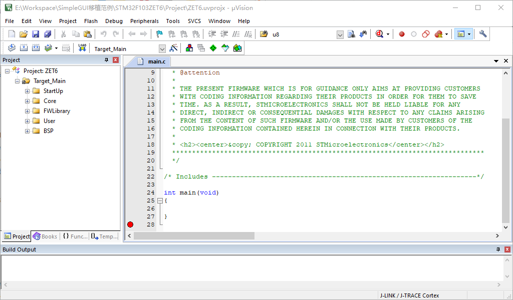</img></p>  
  
&emsp;&emsp;接下来，加入屏幕、定时器和串口初始化代码，这里也包括串口中断服务函数以及定时器中断服务函数。  
&emsp;&emsp;需要注意的是，由于SimpleGUI并没有做线程安全设计，所以GUI接口只允许工作在同一个线程中，如果多个线程（或在中断服务函数中）同时调用SimpleGUI的接口，将导致一些不可预知的错误。由此，在需要使用中断的地方，推荐使用“中断标记-主处理读取”的工作模式。  
  
><p align='center'>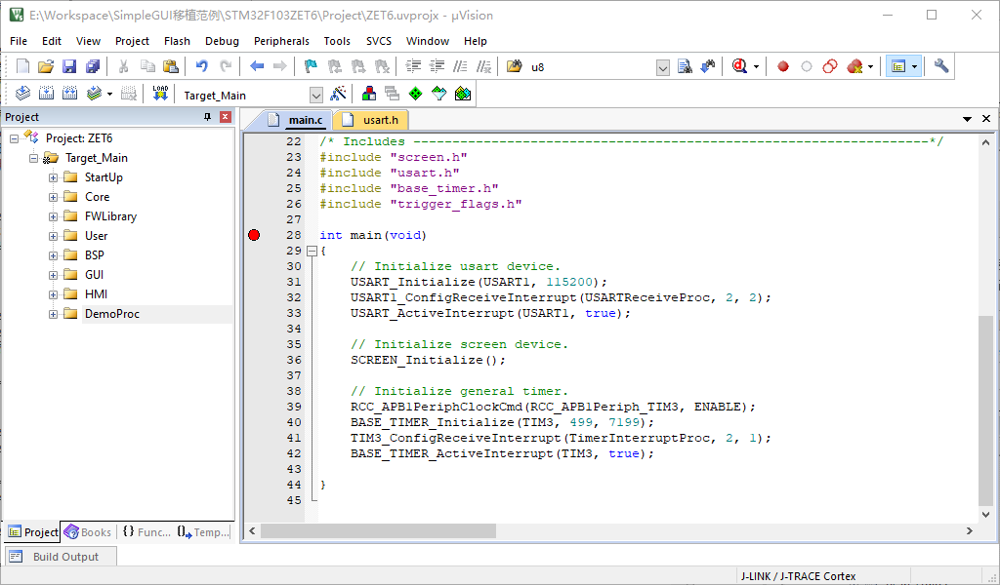</img></p>  

&emsp;&emsp;然后将SimpleGUI代码中的GUI目录、HMI目录、DemoProc目录复制并添加到当前工程。  
  
><p align='center'>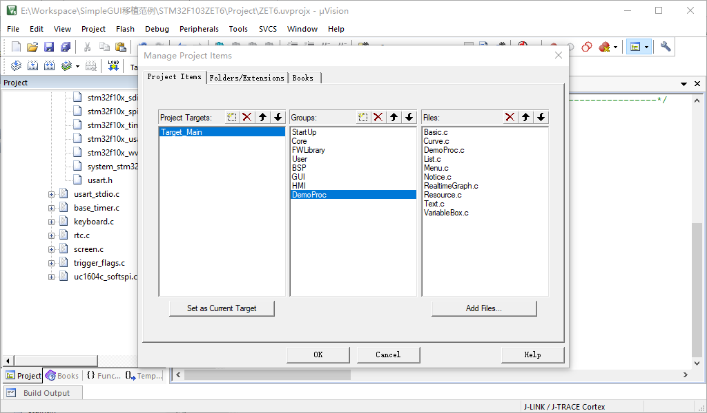</img></p>  
  
><p align='center'></img></p>  

&emsp;&emsp;至此，演示程序需要的所有文件都已经加入工程组织接下来就需要将之前实现的针对当前硬件平台的驱动代码添加到演示程序对应的位置。  
&emsp;&emsp;然后将GUI目录、HMI目录、DemoProc目录下inc文件夹添加到工程的包含路径(Include path)中。  
  
><p align='center'>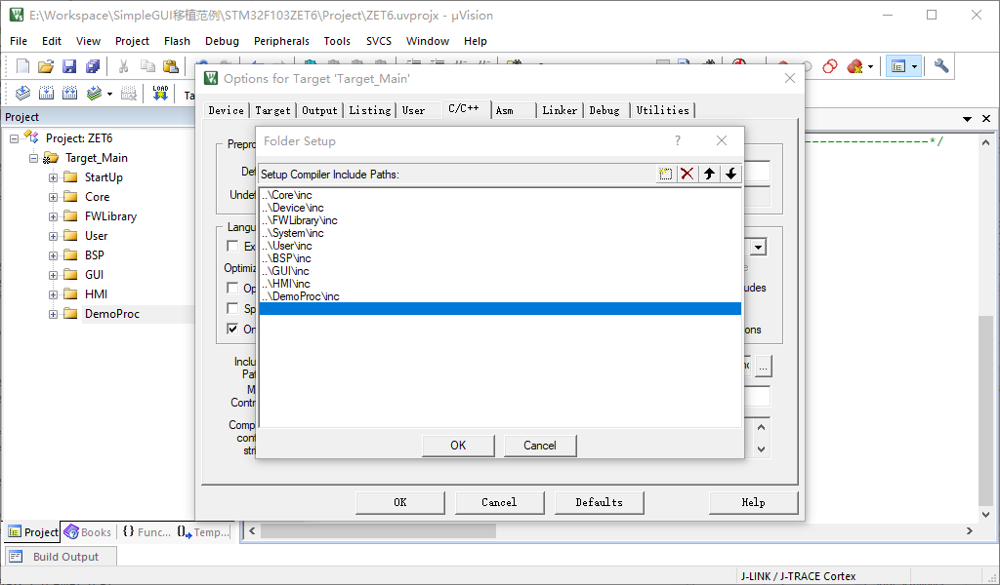</img></p>   
  
&emsp;&emsp;接下来打开GUI\\inc目录下的SGUI_Config.h文件，大致内容如下：  
  
```c++  
//=======================================================================//
//= Used for SimpleGUI virtual SDK.									    =//
//=======================================================================//
#ifdef _SIMPLE_GUI_ENCODE_TEXT_
 #define _SIMPLE_GUI_ENCODE_TEXT_SRC_		("UTF-8")
 #define _SIMPLE_GUI_ENCODE_TEXT_DEST_		("GB2312")
#endif // _SIMPLE_GUI_ENCODE_TEXT_
#define _SIMPLE_GUI_IN_VIRTUAL_SDK_

//=======================================================================//
//= Used for SimpleGUI interface.									    =//
//=======================================================================//
//#define _SIMPLE_GUI_ENABLE_DYNAMIC_MEMORY_
```  
&emsp;&emsp;此文件中定义了SimpleGUI中用于全局配置的宏定义，默认状态下是为了在VirtualSDK环境下运行而配置的，所以直接编译会产生一些错误，为了规避这些错误，我们需要对文件项目做如下修改：  
  
 - 将宏\_SIMPLE\_GUI\_IN\_VIRTUAL\_SDK\_的定义注释掉。  
 - 将宏\_SIMPLE\_GUI\_ENABLE\_DYNAMIC\_MEMORY\_的定义注释掉。  
  
&emsp;&emsp;此修改完成如下图：  
  
><p align='center'>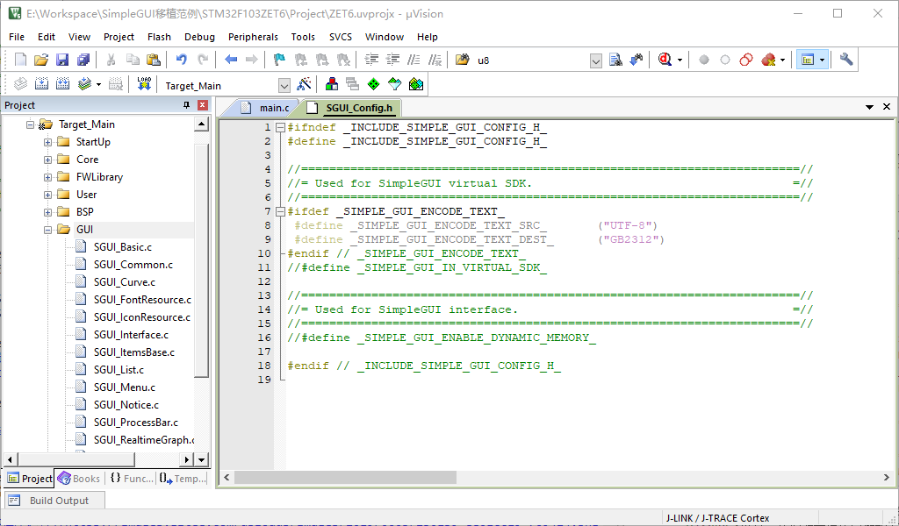</img></p>   
  
&emsp;&emsp;接下来添加演示代码中必要的驱动程序调用。
  
&emsp;&emsp;首先，需要打开DemoProc.c，并定位到InitializeHMIEngineObj函数，演示程序在这里向设备对象模型注册屏幕设备的操作接口。  
  
><p align='center'>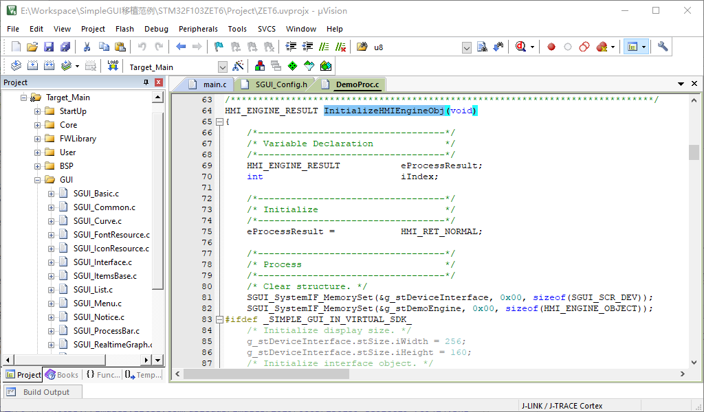</img></p>   
  
&emsp;&emsp;在这个函数中我们可以找到一句宏定义。  
  
```c++ 
#error Add screen device object initialize process here.
```  
  
><p align='center'>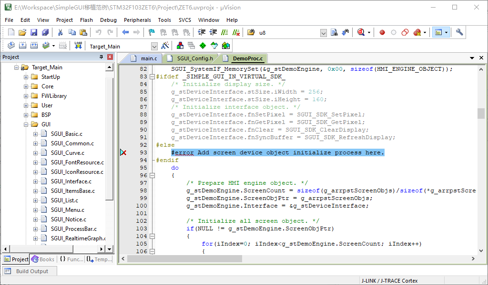</img></p>   
  
&emsp;&emsp;我们需要删除掉这行宏定义，并参照上面宏定义分支中的代码，添加必要的函数接口注册处理。  
  
><p align='center'>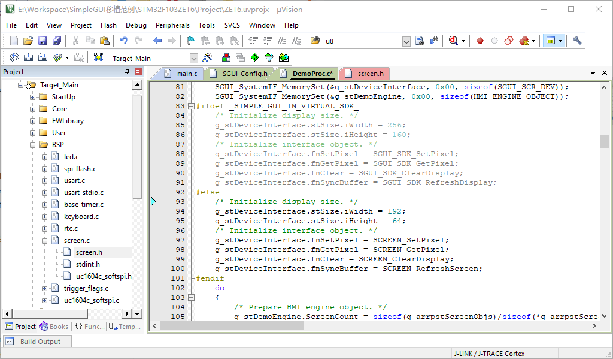</img></p>   
  
&emsp;&emsp;在代码中，我们向设备对象模型注册了屏幕的读点、写点、清空、同步四个动作的操作接口。读点和写点分别是读取和写入屏幕上一个像素的值（0或1，通常0代表灭、1代表亮）必须注册；清空为清除屏幕的内容，如果没有注册，请将此位置置为NULL，SimpleGUI在处理时会通过像色操作清空屏幕，效率稍差；同步操作意为将显示缓存中的内容同步到屏幕显示，只有在启用显示缓存时才会用到。  

&emsp;&emsp;这里的的显示缓存并不是由SimpleGUI来开辟和管理，而是由开发者来定义和操作。现实情况是因为现在几乎所有的单色屏幕，操作都是以字节为单位，一次控制八个像素，如果只想控制其中一个点而不影响其他七个点的话，那么就需要将这个字节读取出来，按位操作写回去。但是这些屏幕控制器在通过串行接口（IIC/SPI）通信时，通常只能接受写入操作，无法读取点，而且就算再并行操作下，读取操作也会比写入操作慢得多。  

&emsp;&emsp;基于以上情况，我自己使用的解决方案就是在芯片内部开辟一处二维数组作为显示缓存，程序的读写都针对这个显示缓存进行操作，在操作完成后再调用同步函数，将显示缓存中的内容集中写入的屏幕。这样做的好处就是，第一，针对片内运存的操作肯定快于直接操作外设接口；第二，避免了读取屏幕的操作，对于屏幕设备来说只有写操作，大大提升了运行速度；第二，基于前一点，屏幕将可以不考虑读操作，直接工作再串行模式下，节省了GPIO的使用。  

&emsp;&emsp;在处理完屏幕初始化操作后，接下来需要处理的就是按键操作的移植。按照前文所说，按键操作是使用串口操作模拟的，所以本质上就是对串口节收内容的处理。  

&emsp;&emsp;同样在DemoProc.c文件中，与上面添加屏幕设备的初始化代码类似，这里添加按键的处理函数，由于按键操作是由串口模拟，所以需要在文件内定义一个全局变量用于保存接收的模拟键码。  
  
><p align='center'>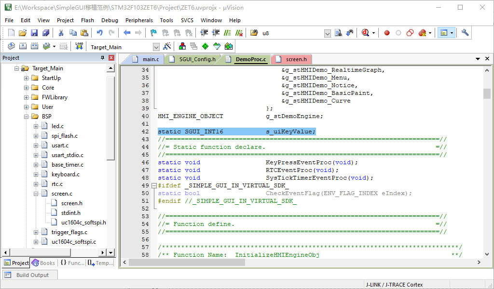</img></p>   
  
&emsp;&emsp;然后定位到KeyPressEventProc函数，并在函数中找到以下宏定义。  

```c++ 
#error Add key event data prepare process here.
```  

&emsp;&emsp;与上面添加屏幕设备的初始化代码类似，删除此宏定义并在这里添加按键的处理函数。  
  
><p align='center'>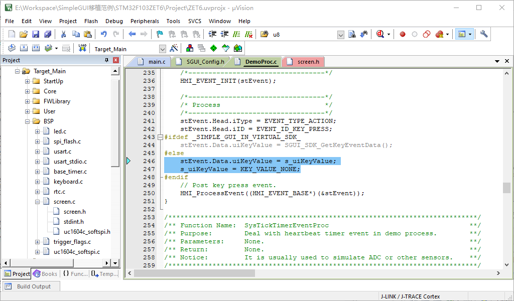</img></p>   
  
&emsp;&emsp;然后定位到UserEventTriggered函数，找到以下宏定义。  

```c++ 
#error Add user event trigger process here.
```  

&emsp;&emsp;删除此宏定义并将读取串口接收数据并保存在全局变量的操作添加到这里。  
  
><p align='center'>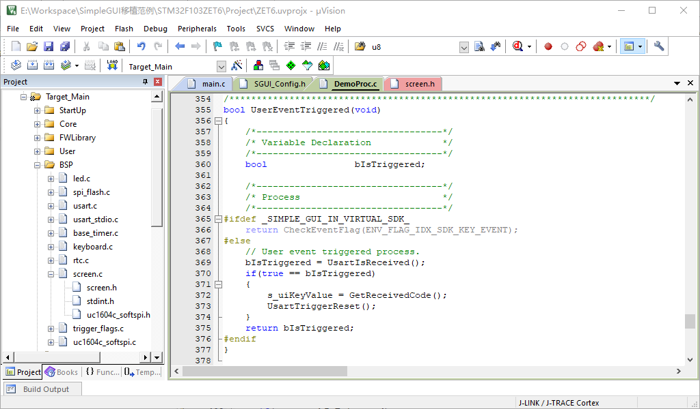</img></p>   
  
&emsp;&emsp;至此，串口模拟按键部分的处理移植完成。接下来需要移植的是通用定时器的处理。同样在DemoProc.c文件中，找到SysTickTimerTriggered函数，并找到以下宏定义。  

```c++ 
#error Add sys-tick timer trigger process here.
```  

&emsp;&emsp;删除此宏定义，并添加定时器触发的判断处理。
    
><p align='center'>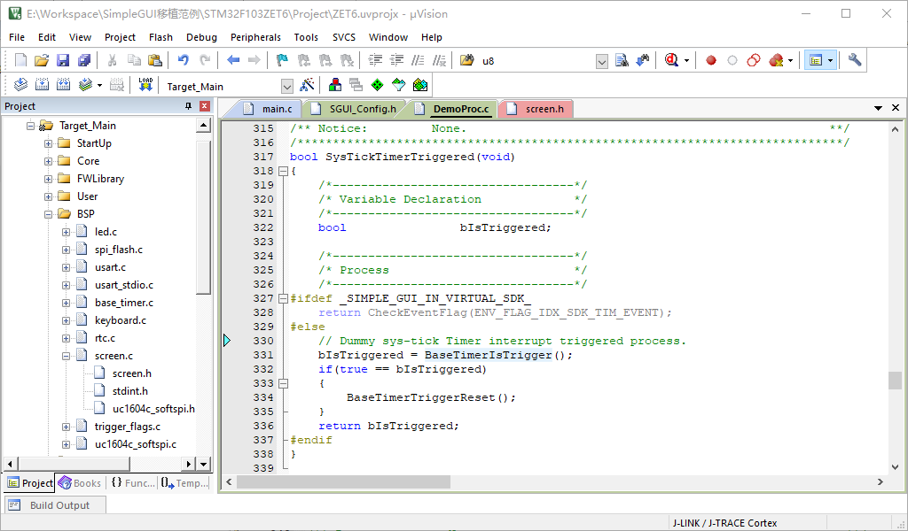</img></p>   
  
&emsp;&emsp;与上面类似，在SysTickTimerEnable函数中找到以下宏定义。

```c++ 
#error Add sys-tick timer enable/disable process here.
```  

&emsp;&emsp;然后添加基本定时器的使能和失能控制接口。
  
><p align='center'>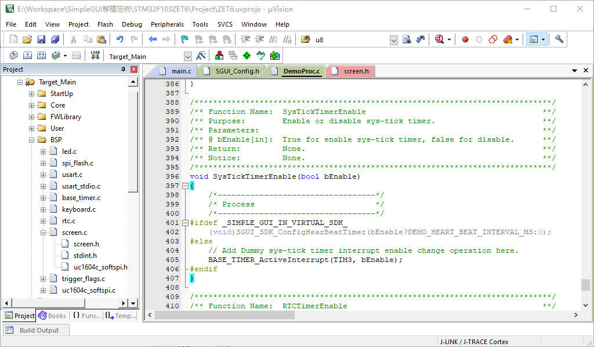</img></p>   
  
&emsp;&emsp;至此，所有机能代码移植完成，可以尝试编译代码了。  
  
><p align='center'>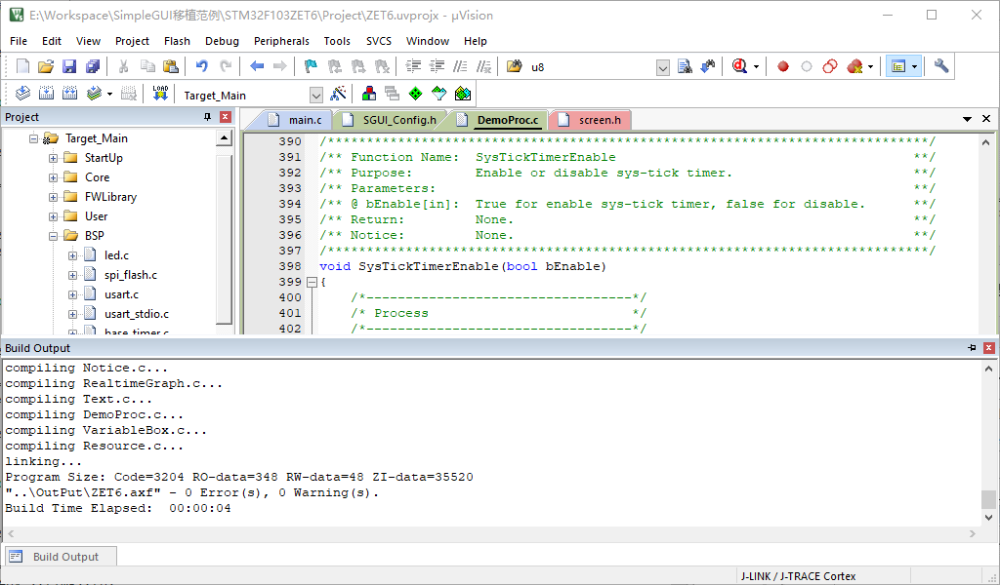</img></p>   
  
&emsp;&emsp;一切正常的话，截至这里的移植应该没有错误，可以顺利编译通过。但此时的演示程序尚不能正常运行，需要将演示程序的主处理加入到main函数中。  
  
><p align='center'>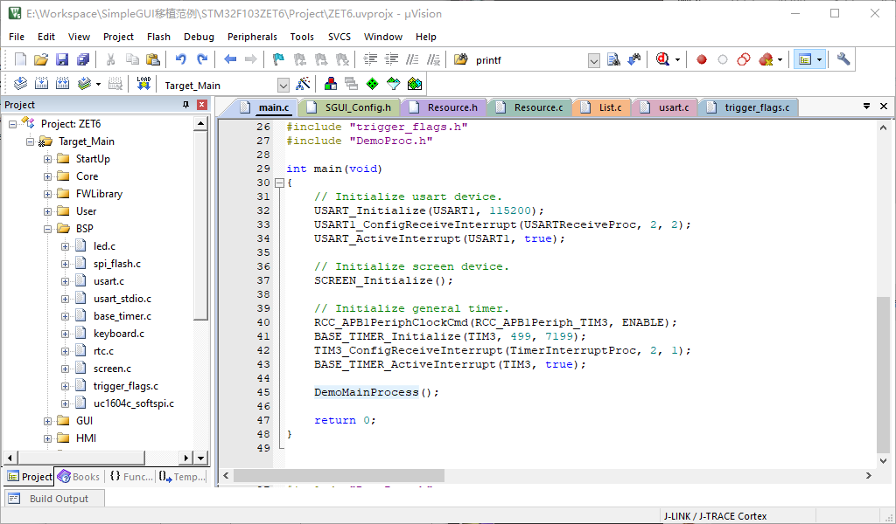</img></p> 
  
&emsp;&emsp;至此，SimpleGUI的演示程序就已经移植完成了，可以开始编译并烧录到芯片。  

><p align='center'>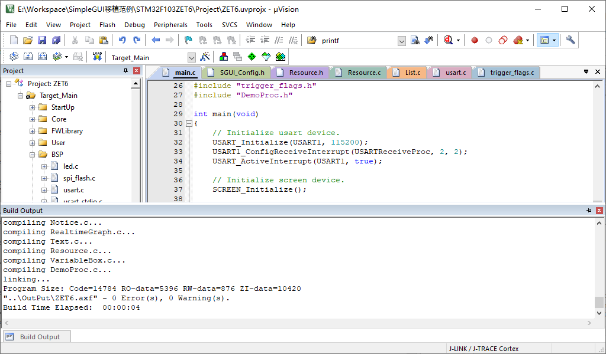</img></p> 

&emsp;&emsp;实际运行效果如图。  

><p align='center'>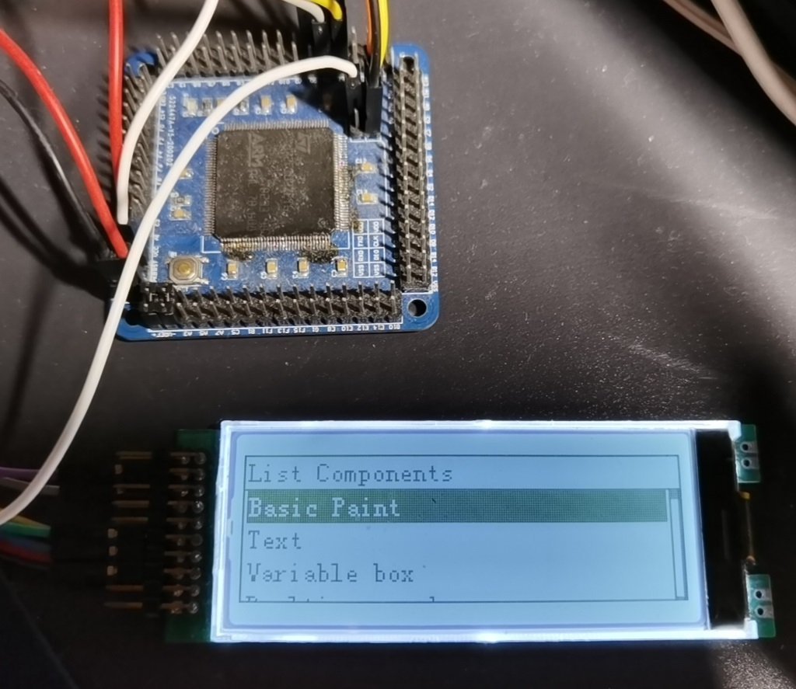</img></p> 

#### 2.2. 与演示程序交互  
&emsp;&emsp;Demo程序为了使同一套演示代码在VirtualSDK中与实际硬件平台中均可以正常运行，都使用了PC键盘的键码进行交互，键码的定义在DemoActions.h文件中。  
  
```c++  
#define		KEY_VALUE_NONE									(0x0000)
#define		KEY_VALUE_BACKSPACE								(0x0008)
#define		KEY_VALUE_TAB									(0x0009)
#define		KEY_VALUE_ENTER									(0x000D)
#define		KEY_VALUE_ESC									(0x001B)
#define		KEY_VALUE_SPACE									(0x0020)
#define		KEY_VALUE_DEL									(0x007F)
#define		KEY_VALUE_HOME									(0x0139)
#define		KEY_VALUE_END									(0x0138)
#define		KEY_VALUE_LEFT									(0x013A)
#define		KEY_VALUE_UP									(0x013B)
#define		KEY_VALUE_RIGHT									(0x013C)
#define		KEY_VALUE_DOWN									(0x013D)
#define		KEY_VALUE_INSERT								(0x0142)
#define		KEY_VALUE_F1									(0x0154)
#define		KEY_VALUE_F2									(0x0155)
#define		KEY_VALUE_F3									(0x0156)
#define		KEY_VALUE_F4									(0x0157)
#define		KEY_VALUE_F5									(0x0158)
#define		KEY_VALUE_F6									(0x0159)
#define		KEY_VALUE_F7									(0x015A)
#define		KEY_VALUE_F8									(0x015B)
#define		KEY_VALUE_F9									(0x015C)
#define		KEY_VALUE_F10									(0x015D)
#define		KEY_VALUE_F11									(0x015E)
#define		KEY_VALUE_F12									(0x015F)
#define		KEY_VALUE_ENTER_PAD								(0x0172)
#define		KEY_VALUE_PLUS_PAD								(0x0184)
#define		KEY_VALUE_SUB_PAD								(0x0186)
// User option flag value define  
#define		KEY_OPTION_CTRL									(0x1000)  
#define		KEY_OPTION_ALT									(0x2000)  
#define		KEY_OPTION_SHIFT								(0x4000)  
  
#define		KEY_CODE_VALUE(CODE)							(CODE & 0x0FFF)  
#define		KEY_CODE_OPT(CODE)								(CODE & 0xF000)  
```  
&emsp;&emsp;完成前文描述的移植操作并成功烧录到芯片中运行，并确保芯片的串口正确连接到电脑后，就可以尝试与SimpleGUI的Demo程序进行交互了。在此之前，请准保好一个您习惯使用的串口调试软件，但此软件需要支持发送十六进制数据。  

&emsp;&emsp;演示程序的初始化面在列表画面中，此时根据上面的键码定义，您可以发送十六进制数据[01 3D]来模拟向下按键，选择列表的下一项，发送[00 0D]来模拟回车键等等。   

><p align='center'>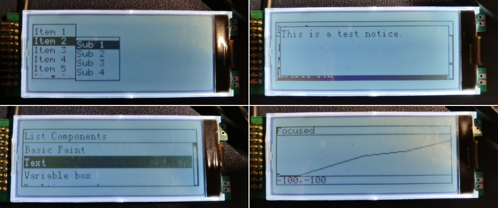</img></p> 

#### 2.3. 启用中文
&emsp;&emsp;SimpleGUI的本身对系统资源的消耗量并不大，但是如果启用中文支持的话，对Flash资源的需求就会急剧增加，以12像素中文为例，每个GB2312字符需要24字节，GB2312中共计6763个字符，这样一来，一个完整的GB2312的12像素字库就需要6763\*24=163K(162312字节)的Flash资源，而如果是16像素文字，每个文字就需要32字节，则字库总计需要消耗6763\*32=217K(216416字节)的数据。  

&emsp;&emsp;当然，SimpleGUI的演示程序中也预置了中文字库资源，只不过考虑到其对资源的消耗，不适合在所有芯片上启用，所以默认为屏蔽状态。如果您使用的是类似于STM32F103ZET6这样的大容量芯片，则可以尝试启用中文字库。  
  
&emsp;&emsp;打开Keil MDK的工程配置，选择C/C++标签，然后在Define项目中添加全局宏定义“_SIMPLE_GUI_DEMO_INNER_CHS_”，然后点击OK。  

><p align='center'>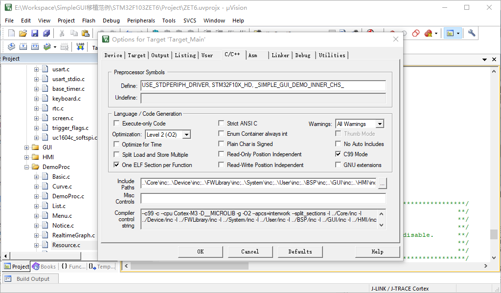</img></p> 

&emsp;&emsp;然后重新编译工程，这时可以看到，编译好的固件对FLASH资源的需求大幅增加。  

><p align='center'>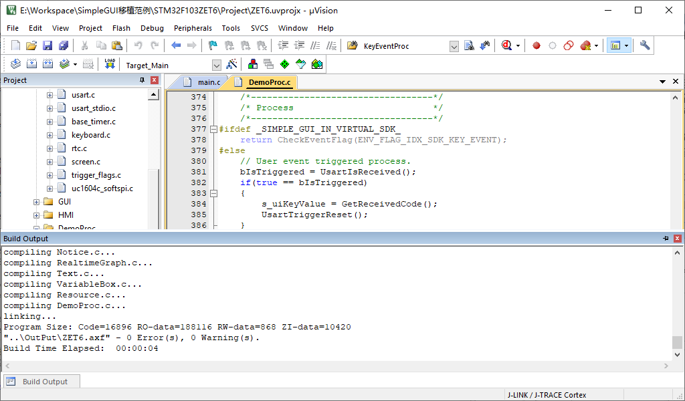</img></p> 

&emsp;&emsp;将编译好的程序烧录到芯片，就可以看到实际效果了。

><p align='center'>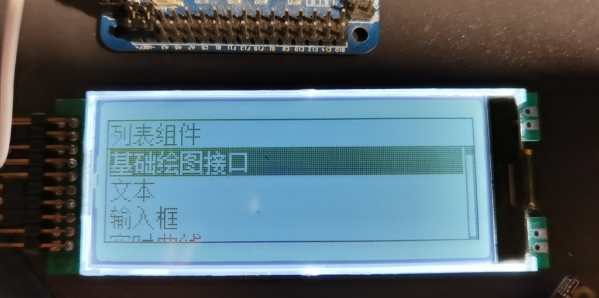</img></p> 

&emsp;&emsp;    
  
## 1. **联系开发者** 
&emsp;&emsp;首先，感谢您对SimpleGUI的赏识与支持。  
&emsp;&emsp;虽然最早仅仅作为一套GUI接口库使用，但我最终希望SimpleGUI能够为您提供一套完整的单色屏GUI及交互设计解决方案，如果您有新的需求、提议亦或想法，欢迎在以下地址留言，或加入[QQ交流群799501887](https://jq.qq.com/?_wv=1027&k=5ahGPvK)留言交流。  
- SimpleGUI@开源中国：https://www.oschina.net/p/simplegui  
- SimpleGUI@码云：https://gitee.com/Polarix/simplegui  
  
&emsp;&emsp;本人并不是全职的开源开发者，依然有工作及家庭的琐碎事务要处理，所以对于大家的需求和疑问反馈的可能并不及时，多有怠慢，敬请谅解。  
&emsp;&emsp;最后，再次感谢您的支持。  
