配置Codeblocks下的wxWidgets开发环境
---
## 1. 关于wxWidgets  

&emsp;&emsp;wxWidgets是一个开源的跨平台的C++构架库，原名wxWindow，它提供一套完整的GUI解决方案。代码的风格与逻辑结构与MFC高度相似，且支持代码及跨平台。  
&emsp;&emsp;wxWidgets的开源遵循L-GPL协议，支持商业免费应用。除了官方组件外，wxWidgets还有很多第三方开源组件支持，例如wxCode等，这些组件中很多也是L-GPL授权的。  
&emsp;&emsp;截至本文档最后一次更新，wxWidgets的最新版本为稳定版3.0.5和开发版3.1.3。  

## 2. 关于Code::Blocks
&emsp;&emsp;Code::Blocks是一个开放源码的全功能的跨平台集成开发环境。主要针对C/C++语言的开发而设计，且支持跨平台，可以在Windows和Linux系统中使用。在支持语法高亮、自动补全等IDE的基本功能的同时，还提供了强大的工程模板和插件支持，例如AStyle格式化插件、代码分析插件、OpenOCD在线调试插件等，几乎可以满足C/C++开发的所有需求。
&emsp;&emsp;CodeBlocks的开源遵循GPLv3协议，使用wxWidgets构架库进行开发。很多工具软件都基于CodeBlocks修改和衍生而来，比如EmBitz、emIDE等。
&emsp;&emsp;截至本文档最后一次更新，CodeBlocks的最新版本为20.03。  

## 3. 基于GCC和Code::Blocks的SDK环境搭建  

#### 2.1. 下载Code::Blocks  

&emsp;&emsp;请访问[Code::Blocks下载页面](http://www.codeblocks.org/downloads)下载Code::Blocks集成开发环境的最新发布版本。  
><p align='center'>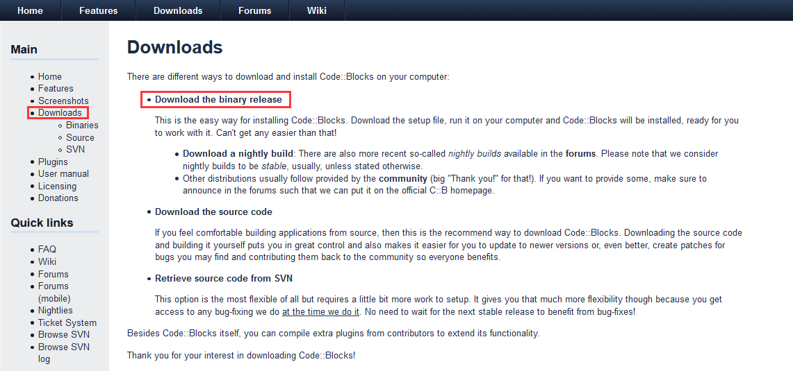</img></p> 
>  
><p align='center'>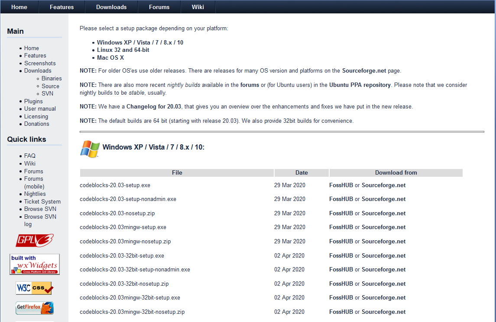</img></p>  

&emsp;&emsp;在Code::Blocks的下载页面中有很多版本可供选择，一般名字以setup结尾且拓展名为exe的，为CodeBlocks安装版的安装程序下载。以nosetup结尾且拓展名为zip的，为CodeBlocks免安装版的压缩包下载，免安装版的CodeBlocks在本地解压后即可使用。名字中带有mingw的则说明此链接中的CodeBlocks安装程序或压缩包附带有MinGW-GCC编译器，附带编译器的版本也会随着CodeBlocks发布版本的迭代，更新为当下最主流的、最新版本的GCC，例如最新的CodeBlocks20.03版本附带的就是MinGW-w64 8.1.0 SEH版本，而前一版本17.12则附带的是TDM-GCC 5.1.0版本。  
&emsp;&emsp;CodeBlocks可以适配多种编译器，比如GCC、CLang、LCC、MSVC等，本例中，将以CodeBlocks20.03版本附带的MinGW-w64 8.1.0 SEH版本为例，讲解CodeBlocks下wxWidgets环境配置的详细操作。  
&emsp;&emsp;为了方便，我们下载codeblocks-20.03mingw-nosetup.zip免安装版。下载完成后，将压缩包解压到本地即可，解压缩的路径请尽量不要放在C盘（系统分区），且路径不要夹杂中文字符、空格或其他特殊符号。  
>- **关于IDE和编译器路径：**
>从Windows Vista开始，由于UAC的引入，系统分区中进行操作的权限可能会受到限制，导致一些问题，所以推荐将CodeBlocks和GCC编译器的目录放在系统分区以外的地方。
>包含中文字符、空格或其他字符的路径可能会导致CodeBlocks中配置号编译器以后，GCC的编译、以及GDB的调试操作不能正常执行，所以请确保编译器的路径中不包含字母、数字之外的任何字符。    
>- **操作系统、应用程序和编译器的位模式**
>从20.03版本开始，CodeBlocks提供了64位版的下载，附带的编译器也为64位。但是需要注意的是，这里编译器的位模式并不取决于当前计算机的系统环境，而是准备编译生成的可执行文件的位模式。例如64位编译器编译出来的是64位可执行文件，无法在32位机上运行，32位编译器编译出来的是32位可执行文件，虽然可以在64位系统中运行，使用的内存资源却有所限制。 
>如果下载的是带有编译器的CodeBlocks，那么默认情况下，附带的GCC编译器会在CodeBlocks程序目录下的MinGW文件夹中部署。  

#### 2.2. 部署wxWidgets

&emsp;&emsp;请访问[wxWidgets下载页面](http://www.wxwidgets.org/downloads/)下载wxWidgets库文件。本例使用最新的稳定版wxWidgets库进行配置，所以转到“Latest Stable Release: 3.0.5”部分，选择，选择该标题下“Binaries”中的“Download windows binaries”链接。
><p align='center'>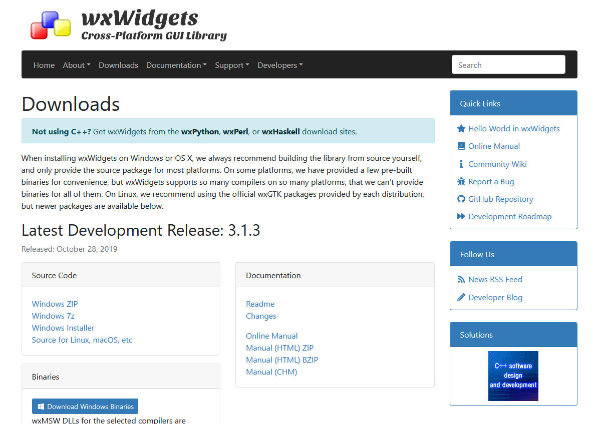</img></p>  
>
><p align='center'>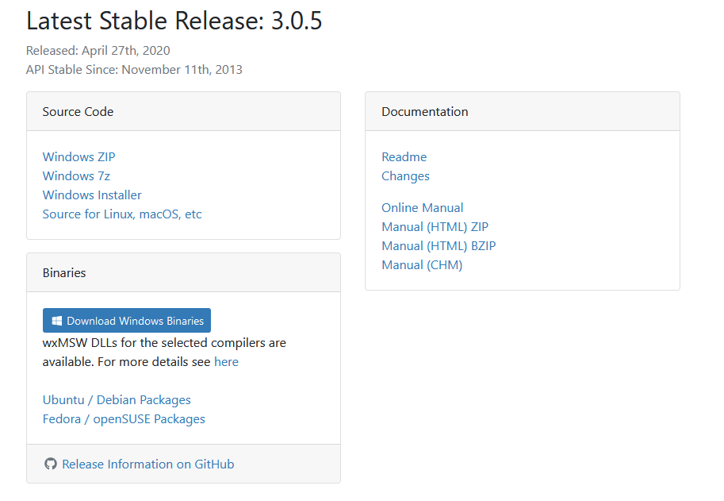</img></p>  

&emsp;&emsp;选择wxWidgets的“Download windows binaries”链接后，页面上会弹出一个抽屉列表，在这个列表中提供了针对不同开发环境或编译器的wxWidgets库和头文件的下载链接。根据前文，我们使用CodeBlocks自带的MinGW-w64 8.1.0编译器，选择为GCC 8.1.0发布的库文件，点开"MinGW-w64 8.1"链接后，弹出的子项目分为三个部分，第一部分“Header Files”，为wxWidgets 3.0.5的头文件包，这个压缩包中包含了当前版本wxWIdgets的主要头文件，第二部分为面向32位目标程序编译和运行的库文件，其中“Developement Files”为所有的开发用库文件（包括DLL动态库以及编译链接时的静态库）以及关联的头文件，包括Debug版本和Release版本，“ReleaseDLLs”则仅包含Release版的DLL文件，通常用于支持已编译和发布的可执行文件；第三部分和第二部分相似，唯一不同的是此部分面向的64位目标程序的编译和运行。  
&emsp;&emsp;由于我们是出于开发目的，所以选择下载“Header Files”和“Development Files”，至于“Development Files”选择那种位模式可以根据自己的需求而定，这里选择下载64位版。
><p align='center'>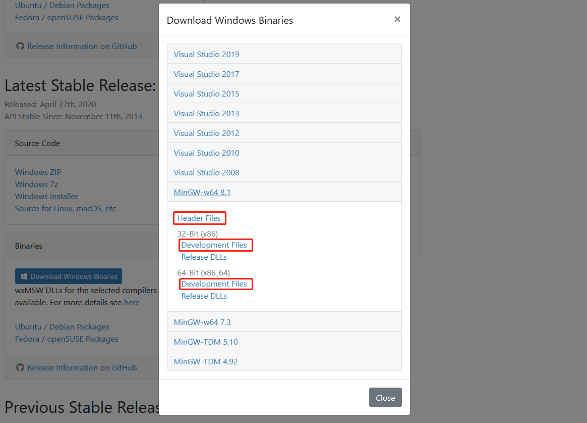</img></p>  

&emsp;&emsp;下载后，请将下载的头文件和库文件解压在同一个文件夹中，解压的路径不宜太长，文件夹名中不要出现括号、下划线、空格等特殊字符，否则将可能导致程序编译时引用文件异常。本范例中部署路径为“E:\Workspace\Librarys\wxWidgets\Stable3.0.5”。解压后，请将库文件的目录名从“gccXXXXXX\_dll”修改为“gcc\_dll”。  
&emsp;&emsp;部署后的目录结构应为：  
```
    wxWidgets库目录  
      ├─ include  
      │  ├─ msvc  
      │  │  └─ wx  
      │  │     └─ setup.h
      │  └─ wx  
      │     ├─ [DIR](子文件夹)
      │     └─ *.h（头文件）
      └─ lib  
         └─ gcc_dll(这个文件夹的名字依据个人使用习惯可能有所不同，通常为gcc_dll或gcc_x64_dll)  
             ├─ mswu
             ├─ mswud   
             └─ *.a(库文件) 
```
 

#### 2.3. 配置Code::Blocks下的wxWidgets开发环境

&emsp;&emsp;启动Code::Blocks，然后选择选择“Settings”（设置）菜单下的“Global variables”（全局变量）项目。  

><p align='center'>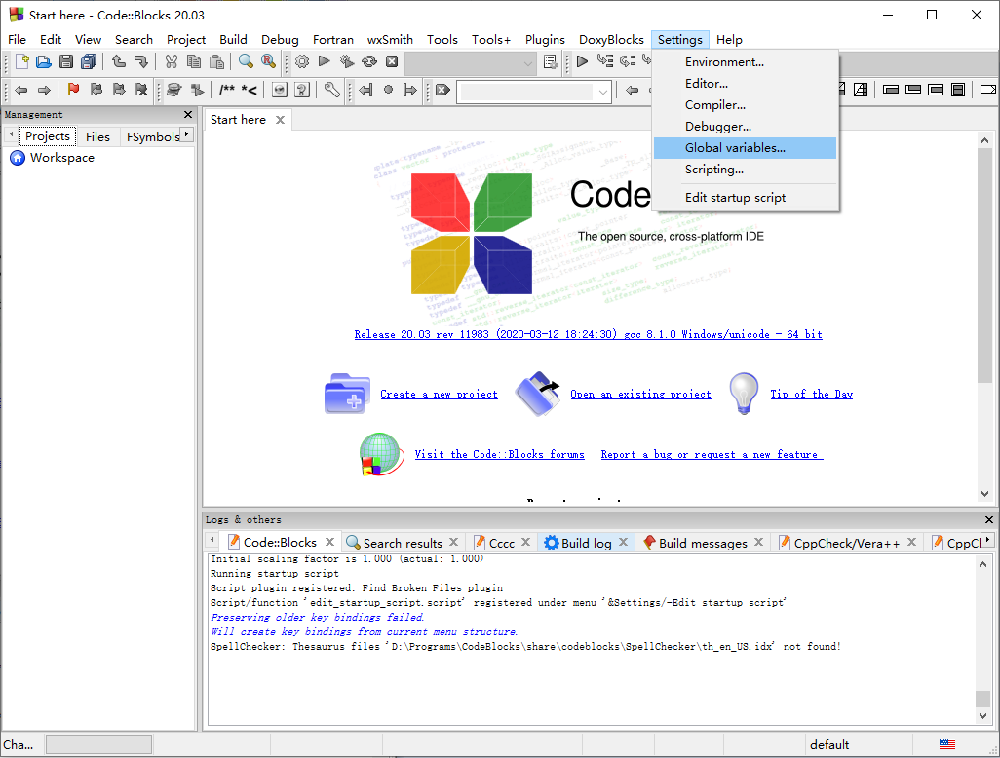</img></p>  

&emsp;&emsp;在打开的全局变量编辑窗口中，点击“New”按钮，新建一个全局变量，命名为“wx”，这个全局变量名需要记住，后续创建CodeBlocks中的wxWidgets工程时，在工程向导中会用到。  
><p align='center'>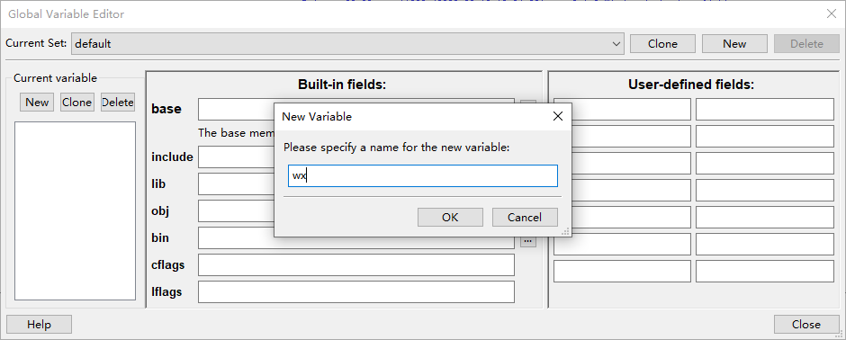</img></p>  

&emsp;&emsp;然后将全局变量的根路径、包含路径和库路经分别设置为wxWidgets的根路径include路径和lib路径，其他留空即可。根据前文本范例中wxWidgets的部署在“E:\Workspace\Librarys\wxWidgets\Stable3.0.5”，所以“base”中的内容为“E:\Workspace\Librarys\wxWidgets\Stable3.0.5”。  
>全局变量配置  
><p align='center'>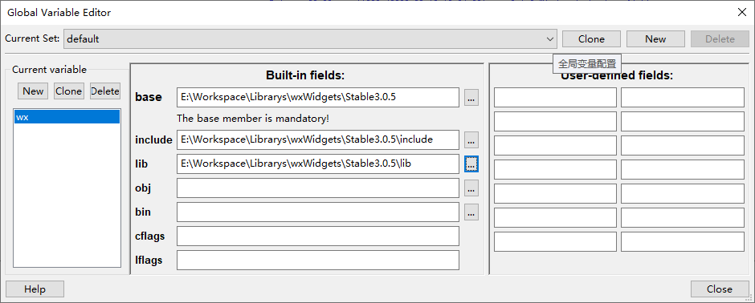</img></p>  
>
>- 关于CodeBlocks中wxWidgets库全局变量的配置与使用：
>事实上，在根据CodeBlocks的工程向导创建的wxWidgets工程中，并没有使用到全局变量中的“include”和“lib”两个成员，这里仅仅是为了后续在使用时提供必要的方便而设置，也可以留空不用填写。  

#### 2.4. 配置编译器与调试器

&emsp;&emsp;在Code::Blocks的“Settings”（设置）菜单下选择“Debuger”（调试器）项目，进入调试器设置页面。  
><p align='center'></img></p>  
  
>- 由于在编译器的配置过程中需要设定对应的调试器，为避免反复操作，所以这里优先进行调试器的设置。  

&emsp;&emsp;在调试器设置页面右侧的树形列表中，选择“GDB/CDB debuger”项目，然后点击“Create Config”（创建配置）按钮，指定名称并新建一个调试器配置，这个名称需要记下，后续配置编译器时会用到。这里以命名为“MinGW-w64 8.1.0”为例。  
><p align='center'>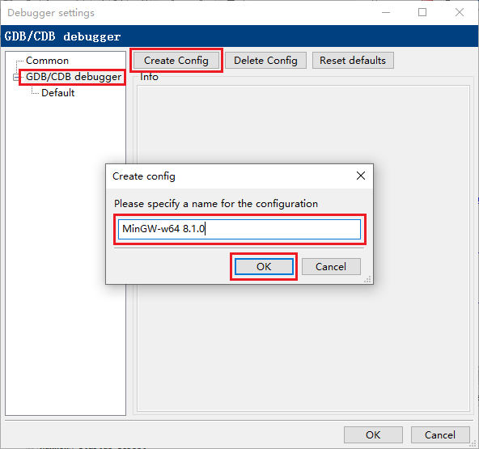</img></p>  
  
&emsp;&emsp;然后点击选中右侧树形工具栏中新建的调试器项目，在右侧“Executable path”中填入调试器终端的路径，其他配置保持默认即可。GDB调试器终端通常在编译器目录下的bin目录中，文件名通常为“gdb.exe”。  
><p align='center'>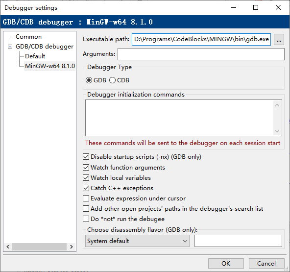</img></p>  

&emsp;&emsp;完成配置后，点击“OK”按钮，完成调试器的配置，然后在Code::Blocks的“Settings”（设置）菜单下选择“Compiler”（编译器）项目，进入编译器设置页面。  
><p align='center'>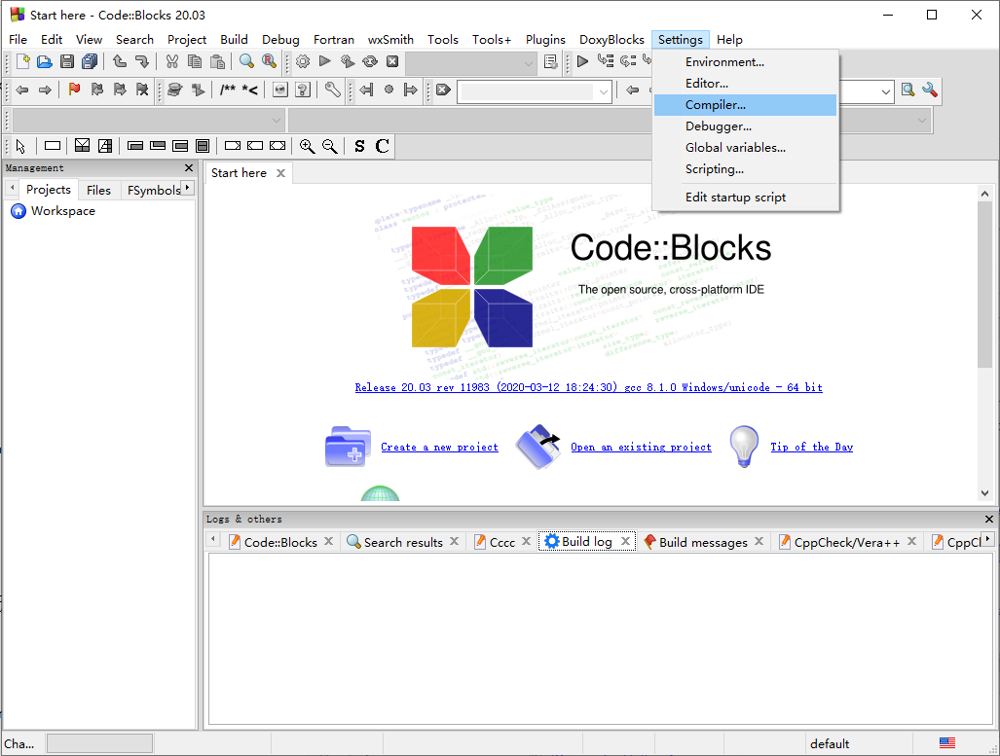</img></p>  

&emsp;&emsp;选择编译器配置页面中的“Toolchain executable”（工具链程序）标签，进入编译器工具链配置界面。  
><p align='center'>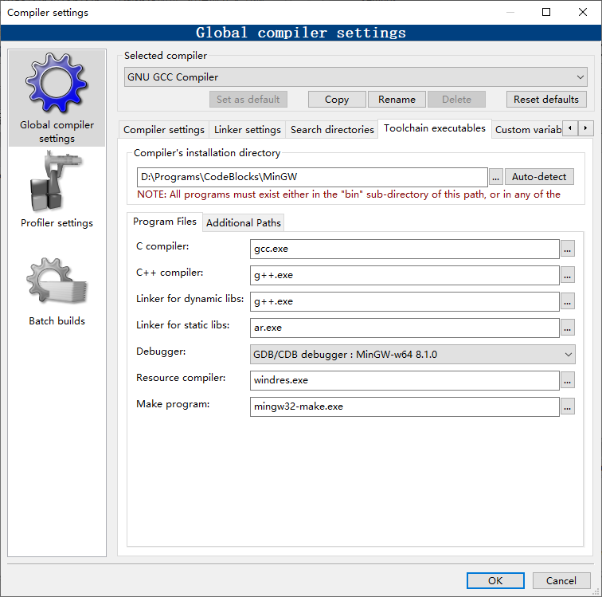</img></p>  

&emsp;&emsp;在此页面中，可以新建、删除或修改配置CodeBlocks预置和保存的各种编译器配置方案。按照本文示例，使用的编译器为MinGW-w64，所以在“Selected Compiler”选项中先择预置的“GNU GCC Compiler”。
&emsp;&emsp;接下来需要确认所选编译器的各项配置，“Compiler's installation directory”项目为编译器的部署路径，由于我们使用CodeBlocks20.03自带的编译器，所以就设定为CodeBlocks目录下的MinGW文件夹的路径即可。  

>- 关于CodeBlocks编译器的路径
>在CodeBlocks的编译器设置中，还可以点击编译器路径右侧的“Auto-detect”按钮，根据当前系统环境自动选择编译器，选择的顺序为“系统环境变量指定”-“CodeBlocks程序目录”-“CodeBlocks预置配置”，如果当前系统中安装过GCC工具链或安装其他程序时附带了GCC组件，进而在系统环境变量中创建了包含GCC路径的环境变量，那么CodeBlocks会优先以环境变量指定的编译器为准设定编译器配置。

&emsp;&emsp;其他的项目如果没有其他特殊需求，那么保持默认即可，需要注意的是Debuger选项，这里指定的是与当前编译器配置匹配的调试器配置，这里选择刚刚创建的“MinGW-w64 8.1.0”调试器。

>- 编译器与调试器配置
>由于在调试模式下、调试程序需要的Debug信息会在编译时写入目标文件，所以调试器的调试模式是需要与编译器匹配的，否则将会出现无法正常调试的现象，比如在使用MinGW-w64 8.1.0编译器的同时，使用TDM 5.1.0的调试器，就会出现无法捕捉断点和异常的情况。  

&emsp;&emsp;完成上述配置后关闭环境变量编辑窗口，至此，基于Codeblocks的wxWidgets开发环境搭建完成。  

## 3. 建立一个简单的工程
#### 3.1. 启动CodeBlocks工程向导

&emsp;&emsp;依次选择菜单栏中“File”、“New”、“Project”菜单，启动CodeBlocks工程向导。  
><p align='center'>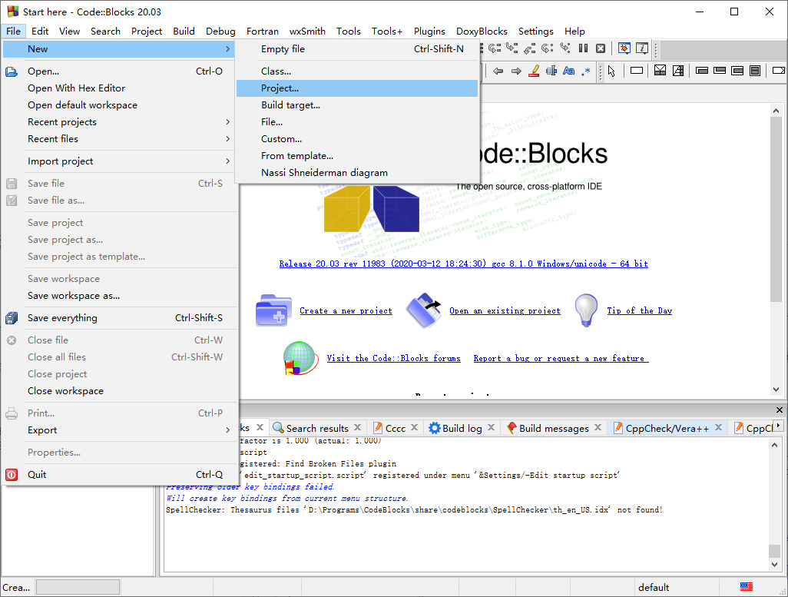</img></p>  

&emsp;&emsp;选择向导列表中的“wxWidgets Project”，然后点击“Go”按钮，开始配置工程。  
><p align='center'>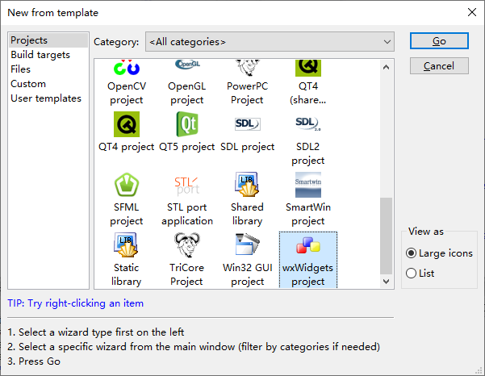</img></p>  

#### 3.2. 创建wxWidgets工程
&emsp;&emsp;第一个面中是wxWidgets工程向导的一些介绍信息，点击“Next”继续。  
><p align='center'>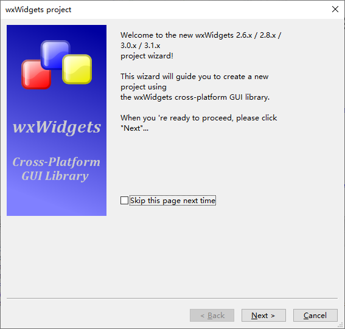</img></p>  

&emsp;&emsp;接下来选择使用的wxWidgets库的版本。  
><p align='center'>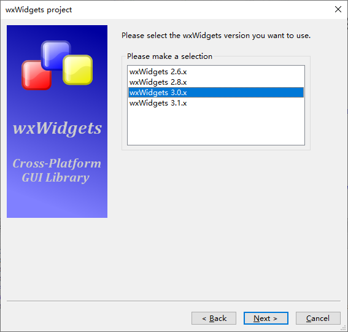</img></p>  

&emsp;&emsp;本示例中部署的为wxWidgets的3.0.5版本，所以选择“wxWidgets 3.0.x”，然后点击“Next”继续。  
&emsp;&emsp;然后是命名新工程并选择创建工程的路径。  
><p align='center'>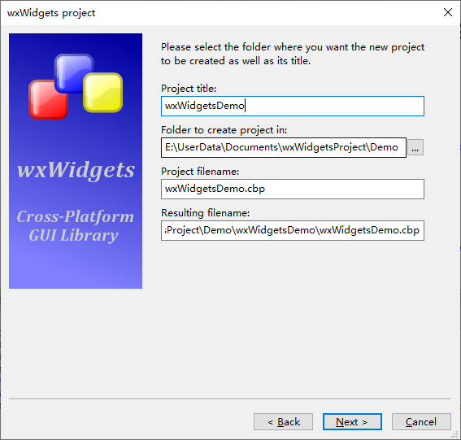</img></p>  

&emsp;&emsp;这里根据自己的使用习惯，设定好工程名称和路径即可，设定完成后点击“Next”继续。
&emsp;&emsp;接下来的页面中，可以录入一些自己的版权信息，包括作者名、电子邮件和个人主页，这些信息将会反映在即将创建的新工程中。  
><p align='center'>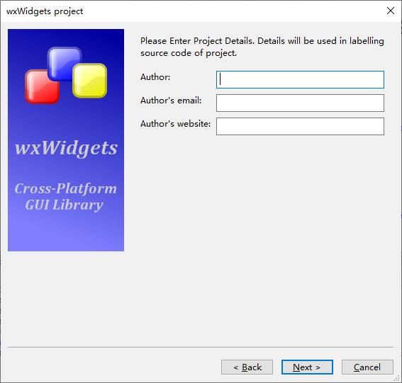</img></p>  
>
&emsp;&emsp;填写完成后点击“Next继续”，当然如果不想填写也可以留空。  
&emsp;&emsp;下一个页面中设定的是设计器类型（GUI Builder）和应用类型(Application Type)。  
><p align='center'>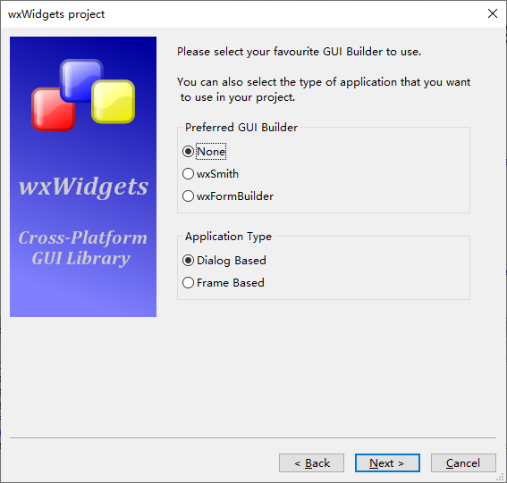</img></p>  

&emsp;&emsp;设计器就是用于构建GUI界面的可视化设计工具，在工程向导中提供了“不使用（None）”、“wxSmith”和“wxFormBuilder”三种，如果选择了“None”以外的选项，则wxWidgets向导会把工程模板初始窗口的设计文件一并放在工程中。当然，如果你对wxWidgerts足够了解，也可以忽略此选项，依靠代码去构建GUI。  
>- wxWIdgets的设计器：
>CodeBlocks的工程向导中，只提供了wxSmith和wxFormBuilder两个选择，其中wxSmith为CodeBlocks的内置设计器，而且CodeBlocks的界面本身也是由wxSmith设计的。但是wxWidgets设计器不止以上两种，除了wxSmith和wxFormBuilder以外，就我个人所知的还有wxCrafter和DialogBlocks两款，其中wxCrafter的可视化效果是最好的，但本身不开源，虽然有免费版，但使用全部功能还需要额外付费，例如Ribbon界面的即时预览等。DialogBlocks也是收费软件，但本身可以编辑代码，而且可以配置编译器，已经达到一个IDE的水平了。wxFormBuilder为开源软件，遵循GPL-2.0协议，而且支持wxWidgets的多语言库，如wxPython等，功能上和wxCrafter的免费版差不多，同样不能预览AUI界面与Ribbon界面，有兴趣的可以点击[wxFormBuilder的Github托管链接](https://github.com/wxFormBuilder/wxFormBuilder)进一步了解。  

&emsp;&emsp;应用类型的选择，用于选择工程模板中主窗体的类型，可选择的项目包括“基于对话框（Dialog Based）”和“基于文档（Frame Based）”，此选择项决定了工程模板中主窗体继承自wxDialog类还是wxFrame类，可根据需求自行选择。  
&emsp;&emsp;全部选择完成后，点击“Next”继续。  
&emsp;&emsp;接下来的页面中，需要制指定一个路径，这个路径就是部署在当前系统中wxWidgets库的路径。  
><p align='center'>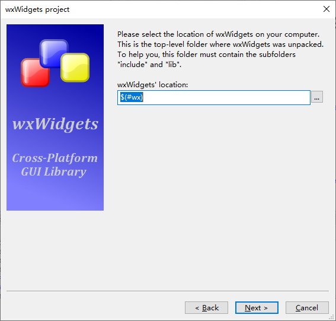</img></p> 
>
&emsp;&emsp;这里就需要用到前文创建的wxWidgets库名字了，填写的内容为"$(#"+全局变量名+“)”，然后工程向导就可以引用这个全局变量，在编译时，编译器就可以通过这个全局变量中的内容，检索相应的路径，找到对应的头文件与库文件。当然，也可以不适用全局变量，在此处直接指定路径。填写完成后，点击“Next”继续。  
>- 关于CodeBlocks的全局变量  
>CodeBlocks的全局变量是一个极具特色的功能，他可以将一些工程参数抽象化，用于吸收在同一个工程所需要的环境依赖在不同计算机上的区别。 
>以本例为例，不同的电脑上，wxWidgets库部署路径可能不相同，但只要都指定了名为“wx”的全局变量，那么工程在解析时，就可以根据全局变量中指定的内容找到wxWidgets部署的真实地址，进而使工程可以在不同的计算机间，不对环境和工程进行修改就可以编译。  
>当然，环境变量的引用不仅仅限于编译过程，同样会被用于其他地方，例如代码提醒与自动补全的解析等。  

&emsp;&emsp;接下来的页面中，是对编译器的选择和编译中间文件和目标文件输出路径的选择。  
><p align='center'>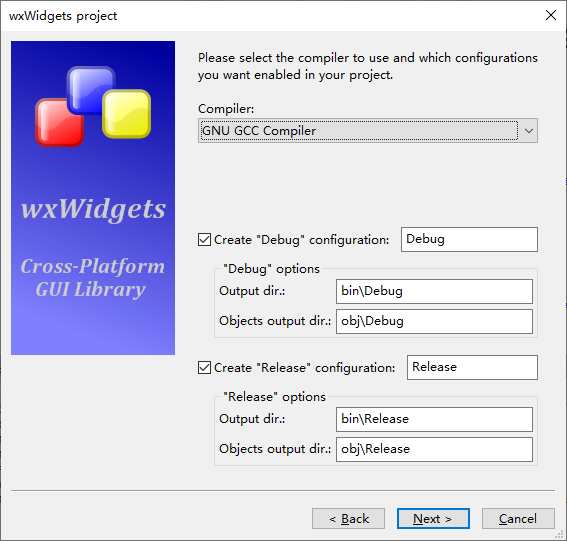</img></p> 

&emsp;&emsp;比较重要的是对编译器的选择，要配合使用的wxWidgets库，否则可能编译出错。这里直接使用默认配置。
&emsp;&emsp;选择完成后，点击“Next”继续。   
&emsp;&emsp;接下来需要选择的是将要使用的wxWidgets库的一些特性，这些特性将决定工程向导将对工程添加哪些库的引用。
><p align='center'>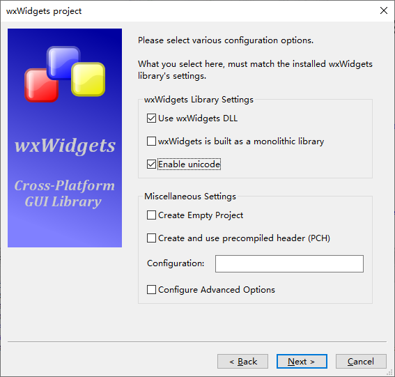</img></p> 

&emsp;&emsp;比较重要的是“wxWidgets Library Setting”中的三个选项。第一个选项“Use wxWidgets DLL”决定使用的是wxWidgets的动态库还是静态库，按前文，我们使用的是wxWidgets发布的Release库，wxWidgets发布的版本均为动态库，所以这里需要勾选。第二个选项“wxWidgets is built as a monolithic library”则决定链接那些库，这里涉及到是否使用wxWidgets库的monolithic模式编译，如果在编译wxWidgets库时，参数指定为true，那么wxWidgets库会被编译成为一个合成库，所有功能都包含在一个库文件中，如果monolithic参数指定为false，那么wxWidgets将会按照功能划分分别编译每一个功能库，通常为了减小编译体积加快编译速度，都不勾选此项目，wxWidgets的Release版本也不包含monolithic模式编译的库文件。第三个选项“Enable Unicode”则决定了文字处理是否使用Unicode，wxWidgets的Release版本均为Unicode发布，所以此项目需要勾选。  
&emsp;&emsp;选择完成后，点击“Next”继续。  

&emsp;&emsp;下一项需要选择的是需要包含的功能库。
><p align='center'>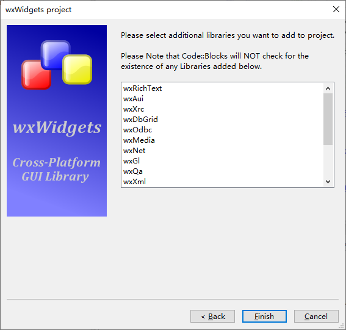</img></p> 

&emsp;&emsp;如果上一步的设定中没有勾选“wxWidgets is built as a monolithic library”设定项，则可以在此画面中选择除了基本GUI功能外，当前创建工程中额外需要包含的更能支持，例如XML解析、PNG或JPG图像解析、正则、ODBC等，此列表中项目可以多选。如果之前“wxWidgets is built as a monolithic library”设定项被选择，则不会出现此设定画面。  
&emsp;&emsp;选择完成后，点击“Finish”按钮完成工程创建。  
><p align='center'>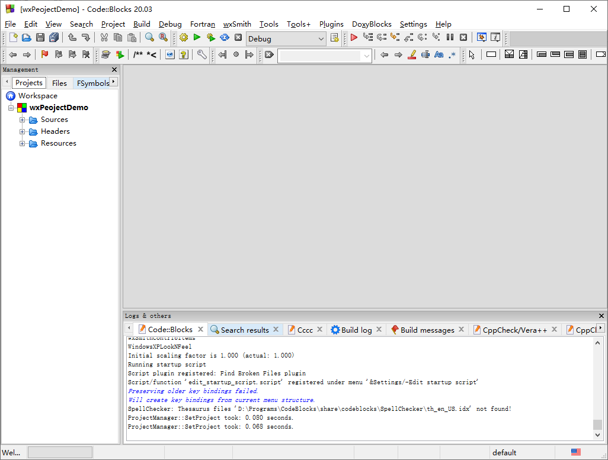</img></p>  
>
&emsp;&emsp;然后点击工具栏上的编译按钮，或者按下键盘上的Ctrl+F9组合键，开始编译工程。  
><p align='center'></img></p>  

&emsp;&emsp;编译完成后，点击工具栏上的原型按钮，或按下键盘上的Ctrl+F10键，运行样例程序。  
><p align='center'></img></p>  

&emsp;&emsp;至此wxWidgets的开发环境搭建并校验完成。  

## 4. 常见错误  
#### 4.1. 编译错误：error: cannot find -lwxmsw30ud  

&emsp;&emsp;**原因：**这个错误是libwxmsw30ud.a库文件找不到所致，通常是由于创建wxWidgets工程时，选择了“wxWidgets is built as a monolithic library”选项，而部署的wxWidgets为官方提供的Release版本，因为wxWidgets的官方Release版本并不提供monolithic模式的库文件。  

&emsp;&emsp;**解决方式：**解决这个错误有两个方法，第一种方法是下载wxWidgets的源代码，自行编译monolithic版本的库文件。第二种方法是重新建立工程，注意取消掉“wxWidgets is built as a monolithic library”选项，或者直接修改工程的库链接选项，移除monolithic版本库的引用，添加非monolithic版本库的引用。  

#### 4.2. 编译错误：error: wx/setup.h: No such file or directory  

&emsp;&emsp;此错误多出现在wxWidgets的platform.h头文件中，错误为找不到一个名为"setup.h"的头文件。  
&emsp;&emsp;这个错误多见于没有使用CodeBlocks的wxWidgets工程向导生成的工程中，或者更换wxWidgets库、更换编译器后。在wxWidgets中，这个头文件有两个，一个位于include/wx/msw下，另一个位于lib/gcc_dll/mswu/wx下，这两个文件的内容是一致的。而在CodeBlocks工程向导中生成的wxWidgets工程，包含的通常都是后者的位置，而后者的位置通常都不是固定的，lib/gcc_dll/mswu/wx这个路径中，“gcc_dll”这个文件夹名称经常发生变化，比如如果用wxWidgets源码进行编译，那么视生成库的类型不同（静态库或动态库），这个文件夹名为“gcc_lib”或“gcc_dll”，如果是从wxWidgets主页下载的Release版本，则会添加编译器名标记，比如面向TDM-5.1.0编译器的库就是gcc510_dll，如果是64位的库的话，还会添加x64字样，变成gcc510_x64_dll。同理，本文档中示例的面向MinGW-w64 8.1.0版本的库64位版，下载并解压后，库的路径事实上是lib/gcc810_x64_dll。顺便再强调一下，wxWidgets官方发布的Release版只有动态库，没有静态的，所以都是dll。  
&emsp;&emsp;所以，再出现这个错误时，请点击“Project”菜单下的“Build options菜单”，进入编译选项。
><p align='center'>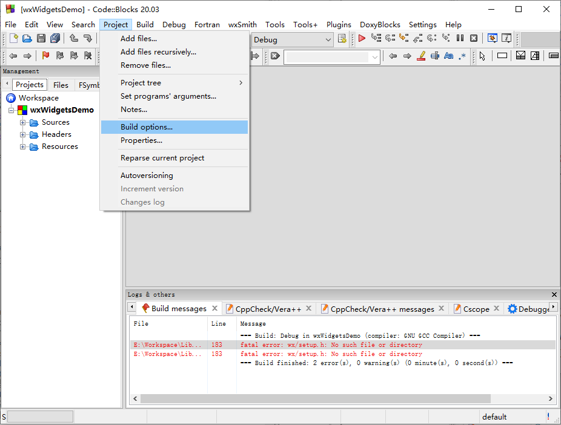</img></p>  

然后分别检查所有编译目标下“Search directories”下的“Compiler”标签中定义的包含路径，通常这个路径都被CodeBlocks的wxWidgets工程向导指定为“$(#wx)\lib\gcc_dll\mswu”，这里需要依实际情况，按需修改。  
><p align='center'>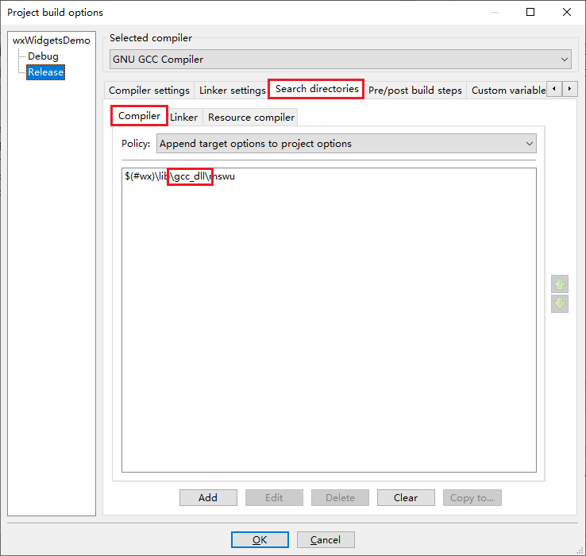</img></p>  

&emsp;&emsp;修改好包含路径，然后单击“OK”，重新开始编译即可。

>- 关于多版本wxWidgets库之间的切换
>如果确实需要多版本wxWidgets库之间进行切换，那么可以考虑使用软连接的思想。软连接的使用类似于快捷方式，但却有类似文件夹的特性，相比于快捷方式，可以提供一个稳定的绝对路径，配合wxWidgets的全局变量，就可以实现wxWidgets库多版本之间的切换了。
>在Windows下创建软链接的命令为“mklink /J”，在Linux中为“ln -s”，具体操作方法可以自行在网上搜索。

#### 4.3. 编译错误：无效的工具链配置

&emsp;&emsp;这个错误是因为编译器配置错误导致的无法开始编译，通常出现在编译一个已经存在的工程，这个工程可能是在别的电脑上建立的或者从网络上下载的。    
&emsp;&emsp;作为一个通用型IDE，CodeBlocks可以保存多个预置的编译器环境，同样的，在一个CodeBlocks工程中，也会记录这个歌工程使用的编译工具链配置。而这个错误，就是当工程中记录的编译工具链配置在当前的CodeBlocks环境中并不存在时出现的。  

><p align='center'>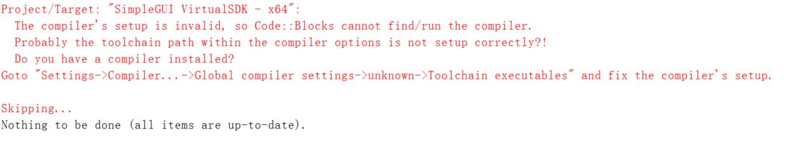</img></p>

&emsp;&emsp;其实这个错误的解决方法已经写在提示中了，参照前文的章节“2.4. 配置编译器与调试器”确保编译器已正确配置即可。同时在工程设置里，确保选择的编译工具链配置为之前配置好的工具链即可。

><p align='center'>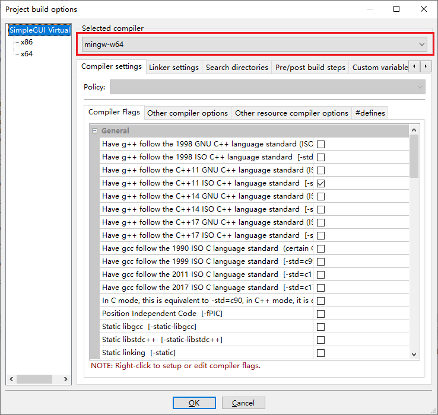</img></p>

&emsp;&emsp;选择设置好的的编译器配置，然后单击“OK”，重新开始编译即可。

### 5. 联系开发者
&emsp;&emsp;首先，感谢您对SimpleGUI的赏识与支持。  
&emsp;&emsp;虽然最早仅仅作为一套GUI接口库使用，但我最终希望SimpleGUI能够为您提供一套完整的单色屏GUI及交互设计解决方案，如果您有新的需求、提议亦或想法，欢迎在以下地址留言，或加入[QQ交流群799501887](https://jq.qq.com/?_wv=1027&k=5ahGPvK)留言交流。  
>SimpleGUI@开源中国：https://www.oschina.net/p/simplegui  
>SimpleGUI@码云：https://gitee.com/Polarix/simplegui  

&emsp;&emsp;本人并不是全职的开源开发者，依然有工作及家庭的琐碎事务要处理，所以对于大家的需求和疑问反馈的可能并不及时，多有怠慢，敬请谅解。
&emsp;&emsp;最后，再次感谢您的支持。  
